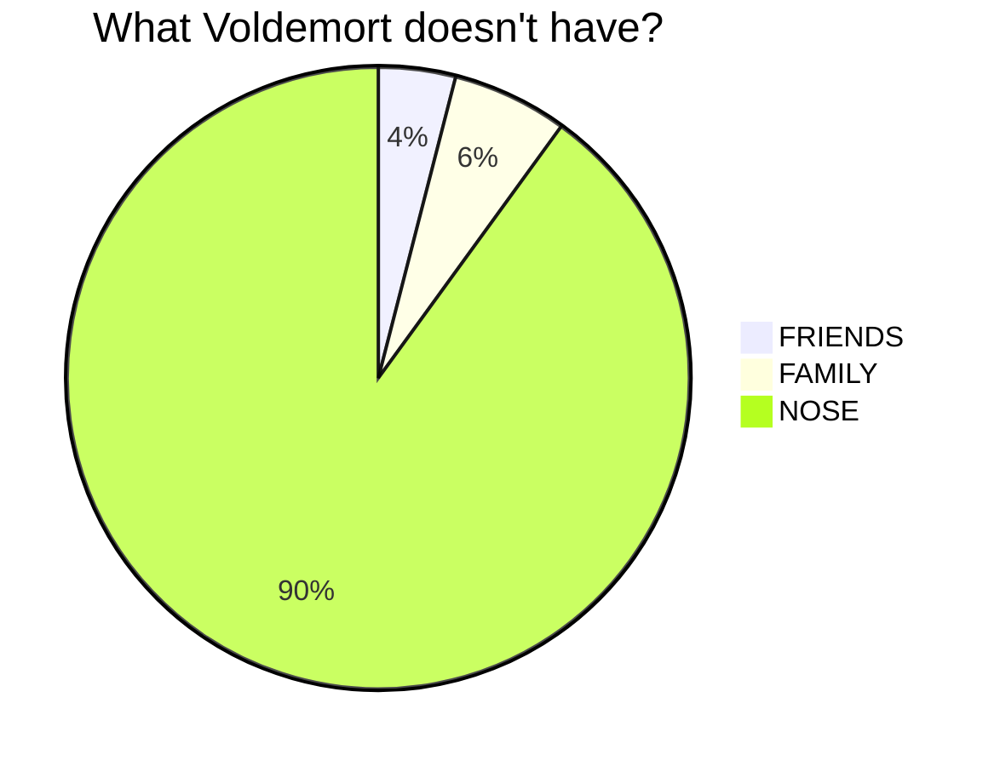

# mermaid

This plugin allows you to use [mermaid](https://mermaid-js.github.io/mermaid/) diagrams in your presentation.

In your slide, you have to wrap your mermaid syntax with a `mermaid` tag:

````

````