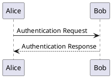

# plantuml

This plugin allows you to use [PlantUML](https://plantuml.com/) diagrams in your presentation.

In your slide, you have to wrap your plantuml syntax with a `plantuml` tag:

````

````

:::warning

This plugin uses an external service. So, you need to be connected to show your presentation.

And the conversion takes a while.

:::